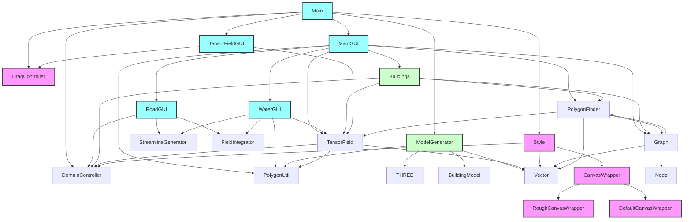

---

### 文件功能和UI描述

#### **伪3D计算和构建**
- **负责部分**:
  - `f:\CODE\GIThub\MapGenerator\src\ts\ui\buildings.ts` 中的 `BuildingModels` 类。
  - `f:\CODE\GIThub\MapGenerator\src\ts\model_generator.ts` 中的 `ModelGenerator` 类。
- **功能**:
  - `BuildingModels` 负责伪3D建筑的计算，包括高度、屋顶和侧面的生成。
  - `ModelGenerator` 负责将伪3D建筑和其他地图元素导出为STL文件。

#### **f:\CODE\GIThub\MapGenerator\src\ts\ui\buildings.ts**
- **伪3D相关功能**:
  - `BuildingModels` 类：
    - `setBuildingProjections()`：根据相机位置和缩放比例，计算建筑的屏幕投影。
    - `heightVectorToScreen()`：将建筑高度转换为屏幕坐标。
    - `getBuildingSides()`：计算建筑的侧面多边形，用于伪3D效果。

#### **f:\CODE\GIThub\MapGenerator\src\ts\model_generator.ts**
- **伪3D相关功能**:
  - `ModelGenerator` 类：
    - 将建筑、道路和其他地图元素挤出为3D模型。
    - 使用 `THREE.js` 生成STL文件。

--- 

### 代码片段示例

#### **伪3D建筑计算**
```typescript
// filepath: f:\CODE\GIThub\MapGenerator\src\ts\ui\buildings.ts
class BuildingModels {
    private domainController = DomainController.getInstance();
    private _buildingModels: BuildingModel[] = [];

    constructor(lots: Vector[][]) {
        for (const lot of lots) {
            this._buildingModels.push({
                height: Math.random() * 20 + 20, // 随机高度
                lotWorld: lot,
                lotScreen: [],
                roof: [],
                sides: []
            });
        }
        this._buildingModels.sort((a, b) => a.height - b.height);
    }

    setBuildingProjections(): void {
        const d = 1000 / this.domainController.zoom;
        const cameraPos = this.domainController.getCameraPosition();
        for (const b of this._buildingModels) {
            b.lotScreen = b.lotWorld.map(v => this.domainController.worldToScreen(v.clone()));
            b.roof = b.lotScreen.map(v => this.heightVectorToScreen(v, b.height, d, cameraPos));
            b.sides = this.getBuildingSides(b);
        }
    }

    private heightVectorToScreen(v: Vector, h: number, d: number, camera: Vector): Vector {
        const scale = (d / (d - h));
        if (this.domainController.orthographic) {
            const diff = this.domainController.cameraDirection.multiplyScalar(-h * scale);
            return v.clone().add(diff);
        } else {
            return v.clone().sub(camera).multiplyScalar(scale).add(camera);
        }
    }

    private getBuildingSides(b: BuildingModel): Vector[][] {
        const polygons: Vector[][] = [];
        for (let i = 0; i < b.lotScreen.length; i++) {
            const next = (i + 1) % b.lotScreen.length;
            polygons.push([b.lotScreen[i], b.lotScreen[next], b.roof[next], b.roof[i]]);
        }
        return polygons;
    }
}
```

#### **3D模型导出**
```typescript
// filepath: f:\CODE\GIThub\MapGenerator\src\ts\model_generator.ts
export default class ModelGenerator {
    private readonly groundLevel = 20;

    constructor(private ground: Vector[],
                private sea: Vector[],
                private coastline: Vector[],
                private river: Vector[],
                private mainRoads: Vector[][],
                private majorRoads: Vector[][],
                private minorRoads: Vector[][],
                private buildings: BuildingModel[],
                private blocks: Vector[][]) {}

    public async getSTL(): Promise<any> {
        // 将伪3D建筑和其他地图元素导出为STL文件
    }
}
```

#### **f:\CODE\GIThub\MapGenerator\src\main.ts**
- **UI**:
  - 主入口文件，初始化整个应用程序的UI，包括`dat.gui`的主界面。
  - 负责管理主画布(`map-canvas`)和图形样式的切换。
  - 提供地图生成、下载功能（PNG、SVG、STL等）。
- **功能**:
  - 调用`MainGUI`协调地图生成。
  - 管理`dat.gui`的交互逻辑。
  - 处理画布的缩放、样式切换和导出功能。

#### **f:\CODE\GIThub\MapGenerator\src\ts\ui\main_gui.ts**
- **UI**:
  - 负责`dat.gui`中“Map”部分的交互。
  - 提供地图生成的核心控制，包括道路、河流、建筑等的生成。
- **功能**:
  - 调用`RoadGUI`、`WaterGUI`和`Buildings`模块生成地图元素。
  - 管理地图生成的流程和依赖关系。
  - 提供地图绘制和更新的接口。

#### **f:\CODE\GIThub\MapGenerator\src\ts\ui\road_gui.ts**
- **UI**:
  - 负责`dat.gui`中道路生成相关的交互。
- **功能**:
  - 使用`StreamlineGenerator`生成道路流线。
  - 提供道路生成的参数配置和更新逻辑。
  - 管理现有道路流线的合并和清理。

#### **f:\CODE\GIThub\MapGenerator\src\ts\ui\water_gui.ts**
- **UI**:
  - 负责`dat.gui`中河流和海岸线生成相关的交互。
- **功能**:
  - 使用`StreamlineGenerator`生成河流和海岸线。
  - 提供河流和海岸线生成的参数配置。
  - 管理河流和海岸线的流线逻辑。

#### **f:\CODE\GIThub\MapGenerator\src\ts\ui\buildings.ts**
- **UI**:
  - 负责`dat.gui`中建筑生成相关的交互。
- **功能**:
  - 使用`PolygonFinder`生成建筑地块。
  - 提供建筑生成的参数配置和更新逻辑。
  - 支持伪3D建筑模型的生成和投影。

#### **f:\CODE\GIThub\MapGenerator\src\ts\ui\style.ts**
- **UI**:
  - 管理地图的样式，包括颜色方案、建筑显示模式等。
- **功能**:
  - 提供`DefaultStyle`和`RoughStyle`两种绘制风格。
  - 管理画布的绘制逻辑和样式切换。

#### **f:\CODE\GIThub\MapGenerator\src\ts\ui\canvas_wrapper.ts**
- **UI**:
  - 抽象画布操作，支持默认画布和RoughJS画布。
- **功能**:
  - 提供绘制多边形、线条、矩形等基本图形的接口。
  - 支持SVG和Canvas两种绘制模式。

#### **f:\CODE\GIThub\MapGenerator\src\ts\ui\drag_controller.ts**
- **UI**:
  - 管理画布的拖拽交互。
- **功能**:
  - 监听鼠标事件，支持画布的拖动和缩放。
  - 与`dat.gui`交互，控制拖拽状态。

#### **f:\CODE\GIThub\MapGenerator\src\ts\impl\water_generator.ts**
- **UI**:
  - 无直接UI。
- **功能**:
  - 生成河流和海岸线的流线。
  - 提供流线的简化和复杂化操作。

#### **f:\CODE\GIThub\MapGenerator\src\ts\impl\graph.ts**
- **UI**:
  - 无直接UI。
- **功能**:
  - 构建道路和建筑的图结构。
  - 处理流线的交点和节点关系。

#### **f:\CODE\GIThub\MapGenerator\src\model_generator.ts**
- **UI**:
  - 无直接UI。
- **功能**:
  - 将地图数据导出为STL文件。
  - 处理多边形的挤出和3D模型生成。

#### **f:\CODE\GIThub\MapGenerator\src\html\index.html**
- **UI**:
  - 提供HTML结构，包括`map-canvas`和`img-canvas`画布。
- **功能**:
  - 加载`bundle.js`脚本，初始化应用程序。

#### **f:\CODE\GIThub\MapGenerator\src\ts\util.ts**
- **UI**:
  - 无直接UI。
- **功能**:
  - 提供通用工具函数，例如随机数生成、CSS颜色解析等。